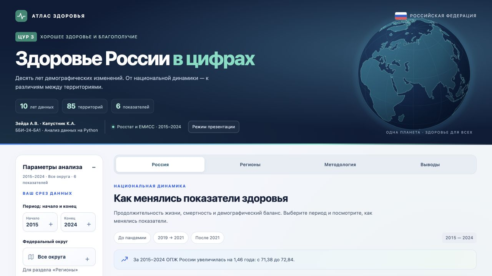
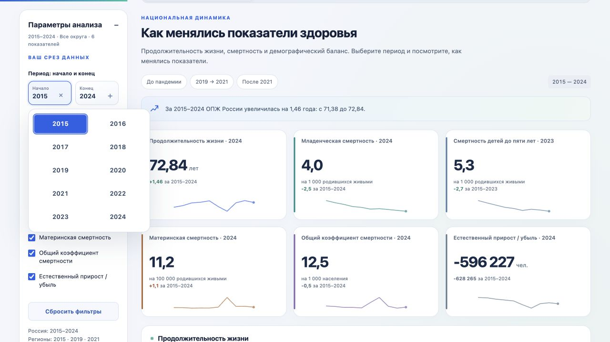
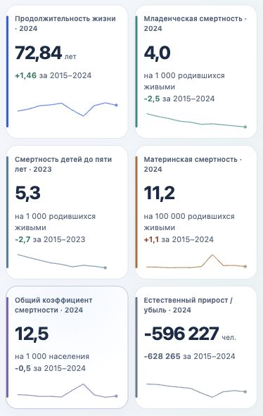

# Общий отчёт по ЦУР 3 и интерактивному дашборду

Зейда А.В., Капустник К.А.

ББИ-24-БА1 · Анализ данных на Python · 2026

## ВВЕДЕНИЕ

Цель устойчивого развития № 3 направлена на обеспечение здорового образа жизни и благополучия людей всех возрастов [1]. Для проекта выбраны продолжительность жизни, детская и материнская смертность, а также показатели естественного движения населения.

Цель работы — подготовить проверяемый набор данных и интерактивный дашборд для анализа национальной динамики и территориальных различий. Объект исследования — демографические показатели здоровья населения России; предмет — их изменения во времени и различия между территориями.

Национальный период — 2015–2024 годы. Региональные данные представлены срезами 2015, 2019 и 2021 годов. Мы сопоставляем начало периода, допандемийный уровень, 2020–2021 годы и последующую динамику. Отдельно рассматривается Приморский край в сравнении с Россией и ДФО.

ОПЖ при рождении характеризует условную продолжительность жизни при сохранении возрастных коэффициентов смертности данного года. Это не средний возраст умерших. Поэтому выбранные данные описывают продолжительность жизни и смертность, а не все стороны здоровья населения.

Для выполнения задания собраны официальные источники, выполнены очистка и контроль качества на Python, рассчитаны производные показатели и подготовлены визуализации. Результат опубликован по адресу https://trust-road.onrender.com/. Пользователь может сопоставить годы и территории, проверить значения в таблицах и выгрузить свой срез.

## 1 Данные и методология

### 1.1 Показатели

В анализ включены шесть основных показателей, приведённых в таблице 1. Их связь с ЦУР 3 различается; контекстные демографические величины не выдаются за прямые глобальные индикаторы.

| Показатель | Единица | Роль в анализе |
|---|---|---|
| Ожидаемая продолжительность жизни при рождении | Лет | Национальный ориентир и характеристика режима смертности |
| Младенческая смертность | На 1000 родившихся живыми | Смертность детей первого года жизни; связана с задачей 3.2 |
| Смертность детей до пяти лет | На 1000 родившихся живыми | Прямой индикатор ЦУР 3.2.1 |
| Материнская смертность | На 100 000 родившихся живыми | Прямой индикатор ЦУР 3.1.1 |
| Общий коэффициент смертности | На 1000 человек населения | Демографический контекст |
| Естественный прирост или убыль | Человек | Баланс рождаемости и смертности |

Младенческая смертность не тождественна смертности до пяти лет и неонатальной смертности. Последняя относится к первым 28 полным дням жизни и имеет код 3.2.2. В итоговых метаданных этот код младенческой смертности не присвоен. Названия прямых индикаторов соответствуют перечню Росстата по ЦУР 3 [1].

Дополнительно сохранены число родившихся, число умерших и число умерших женщин от материнских причин. ОПЖ России представлена для всего населения, мужчин и женщин. По этим рядам рассчитан гендерный разрыв, а по абсолютным числам проверены естественный прирост и коэффициент материнской смертности.

### 1.2 Источники и версия данных

Основой послужили таблицы и notebook, подготовленные Капустником К.А. Первоначальные сводные CSV сохранены отдельно. При доработке использованные числовые значения сопоставлены с официальными источниками; национальная и региональная ОПЖ заменены единой выгрузкой ЕМИСС, показатель 31293 [2]. Это исключает смешение первоначальных оперативных значений с последующими пересчётами.

Для материнской смертности использован показатель 57314 [3], для смертности детей до пяти лет — 58536 [4]. Рождения и смерти сверены с таблицей естественного движения населения [5] и материалами за 2024 год [6]. Младенческая смертность сверена с демографической таблицей [7], ежегодником за 2024 год, таблица 4.17 [8], и сборником «Регионы России», таблица 1.5 [9]. Число материнских смертей подтверждено таблицей Росстата [10] и материалами «Семья и дети в России», страница 51 [11]. Реестр содержит название сохранённого файла, точный указатель таблицы или категории, дату получения и контрольную сумму файла; отдельная таблица фиксирует статус проверки каждого исходного значения.

Снимок источников получен 7 октября 2026 года. Анализ ограничен 2015–2024 годами и не претендует на описание значений 2025–2026 годов. Пометки предварительности относятся к конкретным значениям в сохранённых источниках. Статус ОПЖ 2024 года проверен по сборнику Волгоградстата «Волгоградская область в цифрах», страница 31 [12]. В национальном ряду 2024 года так отмечены общая ОПЖ, числа родившихся и умерших, естественная убыль и общий коэффициент смертности. Материнская смертность 2024 года подтверждена в ЕМИСС: 11,2 на 100 000 родившихся живыми.

Общие коэффициенты смертности за 2015–2021 годы использованы в пересчитанной версии после ВПН-2020. Изменение базы численности населения способно изменить коэффициент при сохранении числа событий. Поэтому прежние и уточнённые коэффициенты не смешиваются в одном ряду.

### 1.3 Территории и пропуски

Региональная таблица включает Россию, восемь федеральных округов и 85 неперекрывающихся территорий сравнения. Архангельская область представлена без Ненецкого АО, Тюменская область — без ХМАО и ЯНАО; автономные округа показаны отдельно. Областные итоги, включающие округа, в рейтинге не используются. Их замена значениями «без АО» выполнена по исходным строкам официальной выгрузки, а не расчётным вычитанием.

Для ЮФО, СФО и ДФО выбраны современные коды ЕМИСС 040, 041 и 042. Исторические наблюдения этих рядов приведены к их составу в выбранной выгрузке. Они не объединяются со старыми кодами округов, имевшими другой охват. Начиная с 2022 года национальные данные используются без ДНР, ЛНР, Запорожской и Херсонской областей, в соответствии со сносками источников и для сохранения сопоставимого охвата.

Во всех трёх выбранных региональных срезах значения доступны. В национальном наборе отсутствуют пять исходных наблюдений: ОПЖ мужчин и женщин за 2024 год, число материнских смертей за 2024 год, смертность до пяти лет за 2017 и 2024 годы. Из-за отсутствия двух половых рядов не рассчитан также гендерный разрыв 2024 года. Отсутствие значения относится к выбранному официальному снимку; оно не означает, что соответствующих данных нет во всех публикациях. Пропуски не интерполируются и не заменяются нулями.

Анализ носит описательный характер. В наборе нет возрастных коэффициентов смертности, причин смерти и сведений о медицинских программах, поэтому причинные эффекты не оцениваются. Все сравнения относятся к указанным годам и территориальному охвату источников.

## 2 Подготовка и контроль качества

### 2.1 Очистка и расчёты

Обработка выполнена на Python с использованием pandas и NumPy. Десятичные запятые и пробелы-разделители тысяч приведены к числовому формату, годы — к целым числам. Обозначения пропусков переведены в NaN, звёздочки предварительности вынесены в отдельное поле.

Сохранены широкие национальная и региональная таблицы и длинная таблица для приложения. В длинном формате строка определяется сочетанием территории, года, показателя и пола. Итоговый набор содержит 399 строк: 110 строк исходных национальных рядов (105 заполненных), 10 строк расчётного гендерного разрыва и 279 строк округов и территорий. Числовое значение доступно в 393 строках, в шести сохранён пропуск. Подготовленные данные экспортируются в CSV; оригинальные официальные XLS/XLSX сохранены как источники.

Рассчитаны абсолютные изменения, темпы прироста, индекс к 2015 году, гендерный разрыв, региональные изменения между срезами и отклонения от России. Для естественного прироста относительные темпы и индексы исключены: ряд переходит через ноль. Разница между региональными срезами не называется годовым приростом.

Абсолютное изменение определяется как Δx = xₜ − x₀. Темп прироста равен (xₜ / x₀ − 1) × 100%, индекс к базовому году — (xₜ / x₂₀₁₅) × 100%. Гендерный разрыв рассчитывается как ОПЖ женщин минус ОПЖ мужчин, отклонение территории от России — как разность двух значений одного года.

Естественный прирост рассчитывается по формуле N = B − D, где B — число родившихся, D — число умерших. Проверочный коэффициент материнской смертности равен M / B × 100 000, где M — число материнских смертей. Полученный результат сравнивается с опубликованным коэффициентом с учётом его округления.

Исходный уровень входит в разность со знаком минус. Поэтому корреляция уровня 2019 года и изменения к 2021 году рассматривается с учётом этой математической связи и не интерпретируется как причинный эффект.

### 2.2 Проверка качества

Результаты обязательных проверок приведены в таблице 2.

| Проверка | Результат |
|---|---|
| Родившиеся − умершие = естественный прирост | Точное совпадение за десять лет |
| Пересчёт материнской смертности по числу случаев | Девять лет; максимальное расхождение 0,047 на 100 000 |
| Общая ОПЖ между мужским и женским значениями | Выполнено за девять полных лет |
| Совпадение России в национальной и региональной таблицах | Выполнено в 2015, 2019 и 2021 годах |
| Уникальность составных ключей | Повторов нет |
| ОПЖ в проверочном диапазоне 55–90 лет | Нарушений нет |
| Неотрицательность коэффициентов и чисел событий | Нарушений нет |
| Отсутствие перекрывающихся территорий | 85 территорий; области без входящих в них АО |

При нарушении обязательных проверок экспорт останавливается. Проверки согласованности дополняют сверку с источниками, но сами по себе не доказывают достоверность первичных наблюдений. ОПЖ России и округов берётся из опубликованных агрегатов, а не как простое среднее региональной ОПЖ.

Правило 1,5 межквартильного размаха для регионов 2021 года дало границы 64,295 и 74,335 года. За ними находятся Чукотский АО, Москва, Дагестан и Ингушетия. Наблюдения сохранены: необычное значение не является достаточным основанием для удаления.

## 3 Результаты анализа

### 3.1 Ожидаемая продолжительность жизни

ОПЖ России выросла с 71,38 года в 2015 году до 73,34 в 2019: на 1,96 года. В 2020 году она составила 71,58, в 2021 — 70,15. Снижение относительно 2019 года равнялось 3,19 года; значение оказалось ниже уровня начала периода.

В 2022 году ОПЖ увеличилась до 72,73, в 2023 — до 73,41 года, максимума рассматриваемого ряда. Значение 2024 года — 72,84: на 0,57 года ниже 2023 и на 1,46 выше 2015 года. Снижение 2020–2021 годов совпадает с пандемийным периодом.

Динамика ОПЖ России и половых рядов представлена на рисунке 1.

Национальный ориентир 78 лет к 2030 году установлен Указом Президента РФ от 07.05.2024 № 309 [13]. Разница со значением 2024 года составляет 5,16 года. Равномерное распределение этой разницы на шесть лет даёт 0,86 года ежегодно, тогда как средний прирост 2015–2019 годов составлял 0,49. Это условный линейный сценарий, а не прогноз или доказательство недостижимости ориентира.

Гендерный разрыв составлял 10,72 года в 2015 году, 9,76 в 2019 и 8,81 в 2021. Его уменьшение в 2021 году сопровождалось снижением ОПЖ у обеих групп: относительно 2019 года у мужчин на 2,64, у женщин на 3,59 года. Оно не означает улучшения положения мужчин. В 2023 году разрыв составил 10,70 года: 78,74 у женщин против 68,04 у мужчин. Оценка вклада отдельных возрастов потребовала бы возрастных коэффициентов смертности и отдельной декомпозиции.

### 3.2 Детская и материнская смертность

Младенческая смертность снизилась с 6,5 на 1000 родившихся живыми в 2015 году до 4,0 в 2024: на 38,46%. При общей нисходящей динамике в 2021 году наблюдался небольшой рост с 4,5 до 4,6. Значение оставалось ниже уровня 2019 года — 4,9.

Смертность детей до пяти лет уменьшилась с 8,0 в 2015 году до 5,3 в 2023 году: на 33,75%. В 2020 году коэффициент составлял 5,5, в 2021 — 5,8, затем снизился до 5,6 в 2022 году. Пропуск 2017 года сохранён в данных; изменение за 2015–2023 годы рассчитано только по доступным конечным значениям.

Материнская смертность выросла с 9,0 на 100 000 в 2019 году до 34,5 в 2021 — в 3,83 раза. Число случаев увеличилось со 134 до 482. Затем коэффициент снизился до 13,0 в 2022, 13,3 в 2023 и 11,2 в 2024. Последнее значение на 67,54% ниже пика, но на 24,4% выше уровня 2019 года. Число случаев за 2024 год не подтверждено в выбранных источниках, поэтому из коэффициента не восстановлено.

Сопоставление динамики детской и материнской смертности приведено на рисунке 2.

У коэффициентов сохранены разные единицы измерения. Их числовые уровни не сравниваются напрямую. 

### 3.3 Общая смертность и естественная убыль

Общий коэффициент смертности вырос с 12,2 на 1000 человек в 2019 году до 16,6 в 2021, после чего снизился до 12,1 в 2023. В 2024 году он составлял 12,5. Коэффициент зависит от возрастного состава населения, поэтому не используется как самостоятельная оценка качества здравоохранения.

В 2015 году естественный прирост составлял 32 038 человек. В остальные годы периода наблюдалась убыль. Максимальное отрицательное значение получено в 2021 году: −1 043 341, при 1 398 253 родившихся и 2 441 594 умерших. В 2023 году убыль составила 500 264, в 2024 — 596 227 человек.

Естественный прирост и убыль по годам показаны на рисунке 3.

Естественная убыль равна разнице между рождениями и смертями. Она не включает миграцию и не равна общему изменению численности населения. Наблюдаемые значения описывают демографический баланс, но не устанавливают причины изменения рождаемости или всех случаев смерти.

### 3.4 Регионы и Приморский край

В 2021 году максимальная ОПЖ среди территорий сравнения составляла 76,28 года в Дагестане, минимальная — 64,00 в Чукотском АО. Разница равна 12,28 года. Ингушетия имела значение 75,77, Москва — 74,60; Еврейская автономная область — 65,96, Амурская область — 66,10 года.

Верхние и нижние значения ОПЖ территорий представлены на рисунке 4.

Общероссийское значение 2021 года — 70,15 года. Выше него не менее чем на год находились 16 территорий, ниже не менее чем на год — 45, у 24 разница была меньше года. Это число территорий, а не доля населения: при подсчёте крупная область и малонаселённый округ имеют одинаковый вес.

Корреляция уровня ОПЖ 2019 года с изменением к 2021 году равна −0,38.

ОПЖ Приморского края составляла 69,14 года в 2015, 70,42 в 2019 и 68,53 в 2021. Изменения между срезами равны +1,28 и −1,89 года. Снижение между 2019 и 2021 годами было меньше общероссийского — −3,19. Отставание от России уменьшилось с 2,92 до 1,62 года. В 2021 году край занимал 57-е место среди 85 территорий сравнения и превышал значение ДФО: 68,53 против 67,95 года. 

Сравнение Приморского края, ДФО и России показано на рисунке 5.

## 4 Интерактивный дашборд

### 4.1 Структура и публикация

Подготовка и расчёты выполнены на Python, графики построены с помощью Plotly. Основная витрина — автономный HTML со встроенными данными и русской локализацией. Он открывается локально без внешних ресурсов. Streamlit сохранён как альтернативная реализация.

Сайт содержит четыре раздела: «Россия», «Регионы», «Методология» и «Выводы». Для страны доступны карточки, временные графики, таблица и CSV. Для регионов — сравнение территорий, рейтинг, диаграмма уровня и изменения ОПЖ, сопоставление округов и таблица.

Публикация на Render связана с репозиторием https://github.com/sanisymerr/trust-road. Страницу обслуживает сервер Python; обновления основной ветки публикуются автоматически. Финальная версия проверена 08.10.2026: https://trust-road.onrender.com/.

Обложка и навигация опубликованного сайта приведены на рисунке 6.

### 4.2 Фильтры и связанный выбор

Годы выбираются из компактной сетки, федеральный округ — из меню с полными названиями. Это единые элементы с клавиатурным управлением: стрелки, Home и End перемещают выделение, Enter подтверждает выбор, Escape закрывает меню без изменения действующего среза. Границы периода автоматически согласуются, если начало оказывается позже конца. Округ действует на региональную выборку; национальные показатели относятся к России.

Региональные значения доступны за 2015, 2019 и 2021 годы. Год рейтинга выбирается только среди срезов, попавших в период. Для периода без этих лет выводится короткое сообщение об отсутствии региональных наблюдений. В карточках России всегда указан фактический год значения: например, последний доступный коэффициент смертности до пяти лет относится к 2023 году.

Для сравнения можно выбрать до пяти территорий через поиск, таблицу или клик по региональному графику. Связанный выбор обновляет динамику, выделение точек и карточки территорий. При смене округа территории вне него снимаются с выбора с пояснением. Когда список пуст, региональный CSV содержит все территории текущего округа. Поиск в полной таблице ограничивает только её строки.

Быстрые периоды позволяют перейти к 2015–2019, 2019–2021 и 2021–2024 годам. Период, округ, показатели и территории сохраняются в адресе страницы. CSV России учитывает выбранные годы и показатели, региональный CSV — годы, округ и территории. Режим презентации скрывает боковую панель и увеличивает пространство для анализа.

Карточки и сетка выбора года представлены на рисунке 7.

### 4.3 Оформление и движение

В оформлении использована тёмно-синяя обложка с зелёным акцентом, флаг России и географический глобус. Контур суши взят из открытых данных Natural Earth [14]. Глобус служит оформлением, статистика стран на нём не закодирована. Автоматическое вращение дополняется перетаскиванием: пользователь меняет видимую долготу непосредственно на изображении.

При наведении на глобус автоматическое движение приостанавливается, после выхода указателя возобновляется. При системной настройке уменьшения движения глобус изначально статичен. Отрисовка прекращается в скрытой вкладке и вне экрана; при недоступности Canvas остаётся SVG-изображение.

Карточки дополнены мини-графиками с реальными интервалами лет. На временных графиках линии соединяют доступные наблюдения, точки для отсутствующих значений не отображаются. Соединение линии не добавляет числовых значений в таблицы или CSV. Подсветка реагирует на указатель, вкладки появляются с коротким переходом, верхняя полоска показывает продвижение по странице. Пояснения сокращены до необходимых сведений о годах, единицах и фильтрах.

На телефоне фильтры свёрнуты при первом открытии; текущий срез остаётся видимым. Карточки образуют две колонки, графики — одну. Панель фильтров находится в обычном потоке страницы, а меню выбора ограничены размерами экрана. Мобильные карточки показаны на рисунке 8.

## 5 Проверка и доработка проекта

### 5.1 Критерии и исправления

Проверка интерфейса опиралась на подход Стивена Фью к ясному представлению данных [15], рекомендации Nielsen Norman Group по выбору из списков [16], видимости текущего состояния [17] и движению [18]. Клавиатурное управление сопоставлялось с паттерном выбора W3C WAI [19]. Эти критерии использованы как основа экспертной проверки учебного проекта.

Основные замечания и внесённые изменения приведены в таблице 3.

| Замечание | Исправление |
|---|---|
| Системные стрелки и разнородный вид выбора | Единые элементы: сетка годов и меню округов |
| Скрытый текущий срез при свёрнутых фильтрах | Видимый период, округ и число показателей |
| Молчаливое снятие территорий при смене округа | Короткое сообщение и ясный охват CSV |
| Длинные повторяющиеся пояснения | Сокращены до годов, единиц и необходимых правил |
| Статичное оформление обложки | Географическое вращение и перетаскивание глобуса |
| Панель перекрывала элементы на телефоне | Обычный поток страницы и меню в пределах экрана |
| Карточки показывали только итоговое число | Мини-графики с фактическими годами и пропусками |

### 5.2 Проверка окончательной версии

Проверены выбор и отмена года, клавиатурное перемещение по вариантам, обратный диапазон, быстрые периоды, округ, связанные карточки и отсутствие доступного регионального среза в 2024 году. Проверки данных выполнены отдельно от проверок интерфейса.

При выборе периода 2019–2021 сайт показывает ОПЖ России 70,15 года и изменение −3,19. Для Приморского края в 2021 году отображаются 68,53 года, 57-е место в России и 3-е среди 11 территорий ДФО. CSV только Приморского края за 2019–2021 содержит две строки; выгрузка всего ДФО за 2015–2024 — 33 строки, по три среза для 11 территорий.

Проверены автоматическое движение, вращение перетаскиванием, наведение, прекращение отрисовки вне экрана, уменьшение движения и статичный запасной вариант. На ширине 320 и 390 пикселей горизонтальной прокрутки всей страницы нет; меню выбора помещаются в экран. На публичной странице проверены загрузка, фильтры и отсутствие ошибок в консоли. Опубликованный HTML сопоставлен с локальной проверенной сборкой.

Проверка доступности ограничена клавиатурными сценариями, видимым фокусом и состояниями элементов. Отдельное исследование с участниками и проверка программами чтения с экрана не проводились.

### 5.3 Выполнение задания и совместная работа

Проект выполнен совместно Зейдой А.В. и Капустником К.А. Капустник К.А. подготовил исходные сводные таблицы и первоначальный анализ. На этапе доработки сверены официальные источники, выполнен контроль качества, оформлены окончательная витрина и комплект. Данные, notebook, сайт и отчёт составляют общий результат группы ББИ-24-БА1.

Матрица выполнения технического задания приведена в приложении А. Выполнены выбор одной ЦУР, работа с первичными источниками, национальная динамика за десять лет, анализ шести показателей, подготовка CSV, описание методологии, региональные сравнения, фильтры, связанный выбор и открытая публикация. Состав итогового комплекта указан в приложении Б.

## ЗАКЛЮЧЕНИЕ

За 2015–2024 годы ОПЖ России изменилась неоднородно: рост до 2019 года сменился снижением в 2020–2021, восстановлением к 2023 и уменьшением в 2024 году. Последнее значение выше уровня начала периода, но ниже его максимума.

Младенческая смертность снизилась на 38,46% за 2015–2024 годы, смертность до пяти лет — на 33,75% за 2015–2023. В 2021 году оба показателя временно выросли. Материнская смертность после пика 2021 года снизилась до 11,2 в 2024, оставаясь выше уровня 2019 года. Естественная убыль сохранялась с 2016 года.

Региональная разница ОПЖ 2021 года составляла 12,28 года. Приморский край находился ниже России, но выше ДФО; уменьшение отставания сопровождалось снижением абсолютного значения ОПЖ.

Основные ограничения — три региональных среза, пропуски отдельных национальных наблюдений и отсутствие возрастных коэффициентов и причин смерти. Результаты описывают изменения, но не устанавливают их причины. Практический результат — воспроизводимый набор и интерактивный дашборд, связывающий выводы с числами, единицами и официальными источниками.

Работа связывает расчёты на Python с проверяемой интерактивной витриной. Пользователь может воспроизвести выбранный срез, сопоставить территории и выгрузить данные. Задание выполнено в заявленном периоде и охвате; дальнейшее расширение возможно при появлении сопоставимых официальных региональных рядов и данных о возрастной структуре.

## СПИСОК ИСПОЛЬЗОВАННЫХ ИСТОЧНИКОВ

1. Росстат. Хорошее здоровье и благополучие : данные по показателям цели устойчивого развития № 3. — URL: https://rosstat.gov.ru/sdg/data/goal3 (дата обращения: 07.10.2026). — Текст : электронный.

2. Росстат. Ожидаемая продолжительность жизни при рождении : показатель ЕМИСС № 31293. — URL: https://fedstat.ru/indicator/31293 (дата обращения: 07.10.2026). — Текст : электронный.

3. Росстат. Коэффициент материнской смертности (3.1.1.) : показатель ЕМИСС № 57314. — URL: https://fedstat.ru/indicator/57314 (дата обращения: 07.10.2026). — Текст : электронный.

4. Росстат. Вероятность смерти детей от момента рождения до 5 лет (3.2.1.) : показатель ЕМИСС № 58536. — URL: https://fedstat.ru/indicator/58536 (дата обращения: 07.10.2026). — Текст : электронный.

5. Росстат. Рождаемость, смертность и естественный прирост населения : статистическая таблица, данные по 2023 год. — URL: https://rosstat.gov.ru/storage/mediabank/demo21_2023.xlsx (дата обращения: 07.10.2026). — Текст : электронный.

6. Социально-экономическое положение Центрального федерального округа в 2024 году / Федеральная служба государственной статистики. — Москва, 2024. — URL: https://rosstat.gov.ru/storage/mediabank/cent_fo_4k-2024.pdf (дата обращения: 07.10.2026). — Текст : электронный.

7. Росстат. Младенческая смертность : статистическая таблица, данные по 2022 год. — URL: https://rosstat.gov.ru/storage/mediabank/demo22_2022.xls (дата обращения: 07.10.2026). — Текст : электронный.

8. Российский статистический ежегодник. 2024 : статистический сборник / Росстат. — Москва, 2024. — 630 с. — URL: https://rosstat.gov.ru/storage/mediabank/Ejegodnik_2024.pdf (дата обращения: 07.10.2026). — Текст : электронный.

9. Регионы России. Социально-экономические показатели. 2025 : статистический сборник / Росстат. — Москва, 2025. — 1035 с. — URL: https://rosstat.gov.ru/storage/mediabank/Region_Pokaz_2025.pdf (дата обращения: 07.10.2026). — Текст : электронный.

10. Росстат. Материнская смертность : статистическая таблица, данные по 2022 год. — URL: https://rosstat.gov.ru/storage/mediabank/demo23_2022.xls (дата обращения: 07.10.2026). — Текст : электронный.

11. Семья и дети в России : специальный доклад Общественной палаты Российской Федерации : статистический сборник Росстата. — Москва, 2024. — URL: https://rosstat.gov.ru/storage/2025/02-21/iKdrivYU/ОПРФ_семья_и_дети_концепция04_СМАРТ.pdf (дата обращения: 07.10.2026). — Текст : электронный.

12. Волгоградская область в цифрах. 2024 год : статистическое обозрение / Территориальный орган Федеральной службы государственной статистики по Волгоградской области. — Волгоград : Волгоградстат, 2025. — 358 с. — URL: https://34.rosstat.gov.ru/storage/mediabank/Волгоградская%20область%20в%20цифрах.pdf (дата обращения: 07.10.2026). — Текст : электронный.

13. О национальных целях развития Российской Федерации на период до 2030 года и на перспективу до 2036 года : Указ Президента Российской Федерации от 7 мая 2024 г. № 309 // Официальный интернет-портал правовой информации. — URL: https://publication.pravo.gov.ru/document/0001202405070015 (дата обращения: 07.10.2026). — Текст : электронный.

14. Natural Earth. Land : 1:110 million physical vectors. — URL: https://www.naturalearthdata.com/downloads/110m-physical-vectors/110m-land/ (дата обращения: 07.10.2026). — Текст : электронный.

15. Few, S. Dashboard Confusion Revisited / Stephen Few // Visual Business Intelligence Newsletter. — 2007. — March. — 6 p. — URL: https://www.perceptualedge.com/articles/visual_business_intelligence/dboard_confusion_revisited.pdf (дата обращения: 08.10.2026). — Текст : электронный.

16. Li, A. Dropdowns: Design Guidelines / Angie Li // Nielsen Norman Group. — 2017. — 11 June. — URL: https://www.nngroup.com/articles/drop-down-menus/ (дата обращения: 08.10.2026). — Текст : электронный.

17. Harley, A. Visibility of System Status (Usability Heuristic #1) / Aurora Harley // Nielsen Norman Group. — 2018. — 3 June. — URL: https://www.nngroup.com/articles/visibility-system-status/ (дата обращения: 08.10.2026). — Текст : электронный.

18. Laubheimer, P. The Role of Animation and Motion in UX / Page Laubheimer // Nielsen Norman Group. — 2020. — 12 January. — URL: https://www.nngroup.com/articles/animation-purpose-ux/ (дата обращения: 08.10.2026). — Текст : электронный.

19. W3C. Combobox Pattern // WAI-ARIA Authoring Practices Guide (APG). — URL: https://www.w3.org/WAI/ARIA/apg/patterns/combobox/ (дата обращения: 08.10.2026). — Текст : электронный.

## ПРИЛОЖЕНИЕ А — Выполнение технического задания

В таблице А.1 сопоставлены требования преподавателя и результат проекта.

| Требование | Реализация и подтверждение |
|---|---|
| Одна цель устойчивого развития | ЦУР 3 Хорошее здоровье и благополучие |
| Официальные проверяемые источники | Росстат и ЕМИСС; сохранённые файлы, реестр и контрольные суммы |
| РФ минимум за пять лет и 3–5 показателей | 2015–2024, шесть показателей; временная динамика в разделе 3 |
| Региональные данные при наличии | 85 территорий и 8 ФО; срезы 2015, 2019 и 2021 |
| Очистка и производные показатели на Python | pandas и NumPy; 8 проверок, изменения, индексы, разрыв и рейтинг |
| Подготовленный набор CSV или XLSX | Национальная, региональная и длинная таблицы CSV |
| Полная аналитическая история | Постановка задачи, методология, динамика, сравнения и выводы |
| Интерактивные фильтры и связанный выбор | Годы, показатели, округ, до пяти территорий; графики и таблица |
| Опубликованный дашборд по ссылке | https://trust-road.onrender.com/; проверен 08.10.2026 |

## ПРИЛОЖЕНИЕ Б — Состав комплекта и воспроизведение

Комплект проекта позволяет проследить путь от источника до опубликованного графика. Основные материалы перечислены в таблице Б.1.

| Материал | Назначение |
|---|---|
| assignment | Оригинальное техническое задание преподавателя |
| data/raw/original | Первоначальные таблицы, полученные от Капустника К.А. |
| data/sources | Официальные файлы и реестр источников с контрольными суммами |
| data/quality | Сверка значений, исправления и сведения о публикации |
| data/processed | Подготовленные CSV, данные приложения и результаты проверок |
| prepare_data.py и analysis.ipynb | Подготовка, расчёты и пять аналитических иллюстраций |
| export_dashboard.py и dashboard | Сборка автономной интерактивной витрины |
| serve.py и run.sh | Публикация основной версии на Render |
| app.py | Альтернативная реализация на Streamlit |
| report и README | Общий отчёт, матрица требований и инструкция запуска |

Для повторения анализа устанавливаются зависимости из requirements.txt, выполняется подготовка данных, затем notebook и экспорт HTML. Используется сохранённый снимок источников от 07.10.2026. При обновлении первичных таблиц сначала повторяется контроль качества, после чего согласуются расчёты, графики и текст отчёта.

