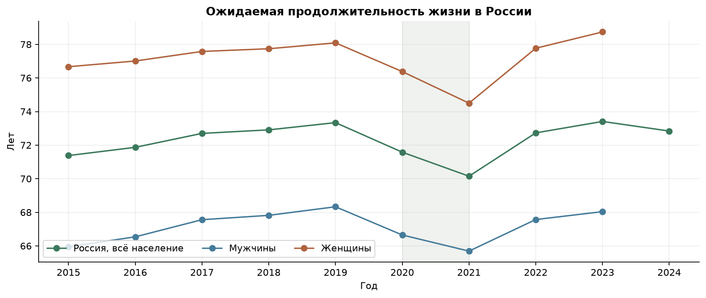
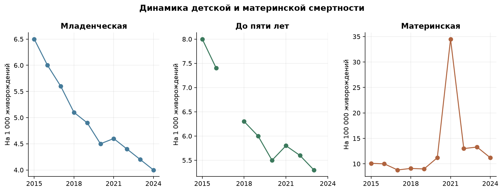
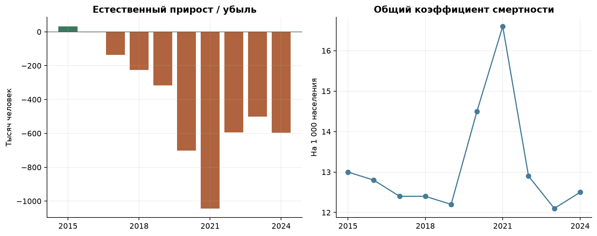
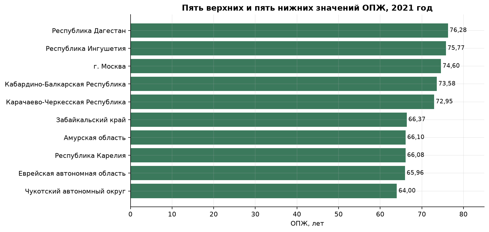
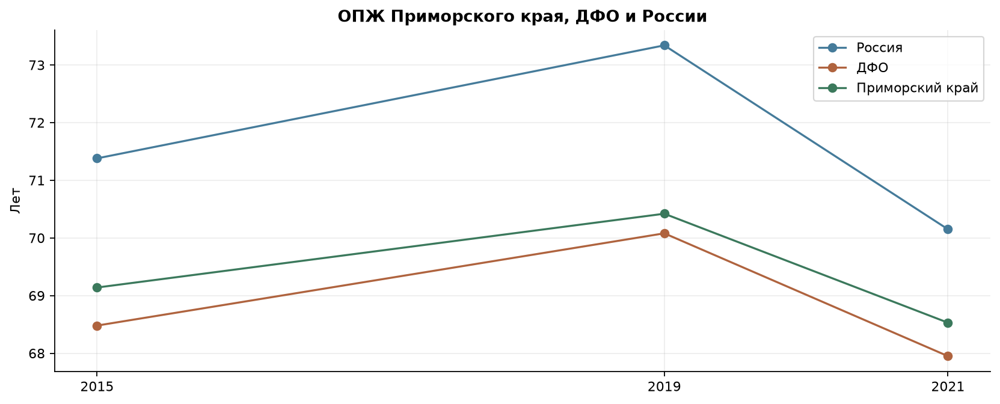

# ЦУР 3 «Хорошее здоровье и благополучие»
## Интерактивный дашборд и анализ демографических показателей России

**Учебный проект по дисциплине «Анализ данных на Python»**

**Авторы:** Зейда А.В., Капустник К.А.  
**Группа:** ББИ-24-БА1  
**Год:** 2026

---

## 1. Постановка задачи

Цель устойчивого развития № 3 направлена на обеспечение здорового образа жизни и благополучия людей всех возрастов. Для проекта выбраны показатели продолжительности жизни, детской и материнской смертности, а также естественного движения населения. Их совместное рассмотрение позволяет проследить общероссийскую динамику и сопоставить положение территорий.

Задача работы — подготовить проверяемый набор данных и интерактивный дашборд с последовательной историей: изменения до 2020 года, значения в 2020–2021 годах и последующая динамика. Отдельно рассматривается Приморский край в сравнении с Россией и Дальневосточным федеральным округом.

Национальный период анализа — 2015–2024 годы, десять ежегодных наблюдений. Региональные данные представлены срезами 2015, 2019 и 2021 годов. Это три опорные точки, а не ежегодный региональный ряд. Такой выбор позволяет сравнить начало периода, допандемийный уровень и 2021 год.

Ожидаемая продолжительность жизни при рождении (ОПЖ) рассчитывается по возрастным коэффициентам смертности соответствующего года. Она описывает условную продолжительность жизни при сохранении этого режима смертности. Это не средний возраст умерших и не прогноз для конкретного поколения. Поэтому проект характеризует динамику продолжительности жизни и смертности, а не все стороны здоровья населения.

## 2. Данные и методология

### 2.1. Показатели

В анализ включены шесть основных показателей. Их связь с ЦУР 3 различается; контекстные демографические величины не выдаются за прямые глобальные индикаторы.

| Показатель | Единица | Роль в анализе |
|---|---|---|
| Ожидаемая продолжительность жизни при рождении | Лет | Национальный ориентир и характеристика режима смертности |
| Младенческая смертность | На 1000 родившихся живыми | Смертность детей первого года жизни; связана с задачей 3.2 |
| Смертность детей до пяти лет | На 1000 родившихся живыми | Прямой индикатор ЦУР 3.2.1 |
| Материнская смертность | На 100 000 родившихся живыми | Прямой индикатор ЦУР 3.1.1 |
| Общий коэффициент смертности | На 1000 человек населения | Демографический контекст |
| Естественный прирост или убыль | Человек | Баланс рождаемости и смертности |

Младенческая смертность не тождественна смертности до пяти лет и неонатальной смертности. Последняя относится к первым 28 полным дням жизни и имеет код 3.2.2. В итоговых метаданных этот код младенческой смертности не присвоен. Названия прямых индикаторов соответствуют [перечню Росстата по ЦУР 3](https://rosstat.gov.ru/sdg/data/goal3).

Дополнительно сохранены число родившихся, число умерших и число умерших женщин от материнских причин. ОПЖ России представлена для всего населения, мужчин и женщин. По этим рядам рассчитан гендерный разрыв, а по абсолютным числам проверены естественный прирост и коэффициент материнской смертности.

### 2.2. Источники и версия данных

Основой послужили таблицы и notebook, подготовленные Капустником К.А. Первоначальные сводные CSV сохранены отдельно. При доработке использованные числовые значения сопоставлены с официальными источниками; национальная и региональная ОПЖ заменены единой выгрузкой [ЕМИСС, показатель 31293](https://fedstat.ru/indicator/31293). Это исключает смешение первоначальных оперативных значений с последующими пересчётами.

Для материнской смертности использован [показатель 57314](https://fedstat.ru/indicator/57314), для смертности детей до пяти лет — [58536](https://fedstat.ru/indicator/58536). Рождения, смерти и младенческая смертность сверены с демографическими таблицами и сборниками Росстата. Источники перечислены в разделе 7. Реестр содержит название сохранённого файла, точный указатель таблицы или категории, дату получения и контрольную сумму файла; отдельная таблица фиксирует статус проверки каждого исходного значения.

Снимок источников получен 7 октября 2026 года. Анализ ограничен 2015–2024 годами и не претендует на описание значений 2025–2026 годов. Пометки предварительности относятся к конкретным значениям в сохранённых источниках. В национальном ряду 2024 года так отмечены общая ОПЖ, числа родившихся и умерших, естественная убыль и общий коэффициент смертности. Материнская смертность 2024 года подтверждена в ЕМИСС: 11,2 на 100 000 родившихся живыми.

Общие коэффициенты смертности за 2015–2021 годы использованы в пересчитанной версии после ВПН-2020. Изменение базы численности населения способно изменить коэффициент при сохранении числа событий. Поэтому прежние и уточнённые коэффициенты не смешиваются в одном ряду.

### 2.3. Территории и пропуски

Региональная таблица включает Россию, восемь федеральных округов и 85 неперекрывающихся территорий сравнения. Архангельская область представлена без Ненецкого АО, Тюменская область — без ХМАО и ЯНАО; автономные округа показаны отдельно. Областные итоги, включающие округа, в рейтинге не используются. Их замена значениями «без АО» выполнена по исходным строкам официальной выгрузки, а не расчётным вычитанием.

Для ЮФО, СФО и ДФО выбраны современные коды ЕМИСС 040, 041 и 042. Исторические наблюдения этих рядов приведены к их составу в выбранной выгрузке. Они не объединяются со старыми кодами округов, имевшими другой охват. Начиная с 2022 года национальные данные используются без ДНР, ЛНР, Запорожской и Херсонской областей, в соответствии со сносками источников и для сохранения сопоставимого охвата.

Во всех трёх выбранных региональных срезах значения доступны. В национальном наборе отсутствуют пять исходных наблюдений: ОПЖ мужчин и женщин за 2024 год, число материнских смертей за 2024 год, смертность до пяти лет за 2017 и 2024 годы. Из-за отсутствия двух половых рядов не рассчитан также гендерный разрыв 2024 года. Отсутствие значения относится к выбранному официальному снимку; оно не означает, что соответствующих данных нет во всех публикациях. Пропуски не интерполируются и не заменяются нулями.

## 3. Подготовка и проверка

Обработка выполнена на Python с использованием pandas и NumPy. Десятичные запятые и пробелы-разделители тысяч приведены к числовому формату, годы — к целым числам. Обозначения пропусков переведены в NaN, звёздочки предварительности вынесены в отдельное поле.

Сохранены широкие национальная и региональная таблицы и длинная таблица для приложения. В длинном формате строка определяется сочетанием территории, года, показателя и пола. Итоговый набор содержит 399 строк: 110 национальных наблюдений, 10 строк расчётного гендерного разрыва и 279 наблюдений округов и регионов. Шесть строк не имеют значения. Подготовленные данные экспортируются в CSV; оригинальные официальные XLS/XLSX сохранены как источники.

Рассчитаны абсолютные изменения, темпы прироста, индекс к 2015 году, гендерный разрыв, региональные изменения между срезами и отклонения от России. Для естественного прироста относительные темпы и индексы исключены: ряд переходит через ноль. Разница между региональными срезами не называется годовым приростом.

| Проверка | Результат |
|---|---|
| Родившиеся − умершие = естественный прирост | Точное совпадение за десять лет |
| Пересчёт материнской смертности по числу случаев | Девять лет; максимальное расхождение 0,047 на 100 000 |
| Общая ОПЖ между мужским и женским значениями | Выполнено за девять полных лет |
| Совпадение России в национальной и региональной таблицах | Выполнено в 2015, 2019 и 2021 годах |
| Уникальность составных ключей | Повторов нет |
| ОПЖ в проверочном диапазоне 55–90 лет | Нарушений нет |
| Неотрицательность коэффициентов и чисел событий | Нарушений нет |

При нарушении обязательных проверок экспорт останавливается. Проверки согласованности дополняют сверку с источниками, но сами по себе не доказывают достоверность первичных наблюдений. ОПЖ России и округов берётся из опубликованных агрегатов, а не как простое среднее региональной ОПЖ.

Правило 1,5 межквартильного размаха для регионов 2021 года дало границы 64,295 и 74,335 года. За ними находятся Чукотский АО, Москва, Дагестан и Ингушетия. Наблюдения сохранены: необычное значение не является достаточным основанием для удаления.

## 4. Результаты анализа

### 4.1. Ожидаемая продолжительность жизни

ОПЖ России выросла с 71,38 года в 2015 году до 73,34 в 2019: на 1,96 года. В 2020 году она составила 71,58, в 2021 — 70,15. Снижение относительно 2019 года равнялось 3,19 года; значение оказалось ниже уровня начала периода.

В 2022 году ОПЖ увеличилась до 72,73, в 2023 — до 73,41 года, максимума рассматриваемого ряда. Значение 2024 года — 72,84: на 0,57 года ниже 2023 и на 1,46 выше 2015 года. Снижение 2020–2021 годов совпадает с пандемийным периодом, однако использованные таблицы не выделяют вклад каждой причины смерти.

Национальный ориентир 78 лет к 2030 году установлен [Указом Президента РФ от 07.05.2024 № 309](https://www.kremlin.ru/acts/news/73986). Разница со значением 2024 года составляет 5,16 года. Равномерное распределение этой разницы на шесть лет даёт 0,86 года ежегодно, тогда как средний прирост 2015–2019 годов составлял 0,49. Это условный линейный сценарий, а не прогноз или доказательство недостижимости ориентира.

Гендерный разрыв составлял 10,72 года в 2015 году, 9,76 в 2019 и 8,81 в 2021. Его уменьшение в 2021 году сопровождалось снижением ОПЖ у обеих групп: относительно 2019 года у мужчин на 2,64, у женщин на 3,59 года. Оно не означает улучшения положения мужчин. В 2023 году разрыв составил 10,70 года: 78,74 у женщин против 68,04 у мужчин. Оценка вклада отдельных возрастов потребовала бы возрастных коэффициентов смертности и отдельной декомпозиции.

### 4.2. Детская и материнская смертность

Младенческая смертность снизилась с 6,5 на 1000 родившихся живыми в 2015 году до 4,0 в 2024: на 38,46%. При общей нисходящей динамике в 2021 году наблюдался небольшой рост с 4,5 до 4,6. Значение оставалось ниже уровня 2019 года — 4,9.

Смертность детей до пяти лет уменьшилась с 8,0 в 2015 году до 5,3 в 2023 году: на 33,75%. В 2020 году коэффициент составлял 5,5, в 2021 — 5,8, затем снизился до 5,6 в 2022 году. Разрыв ряда за 2017 год сохранён; изменение за 2015–2023 годы рассчитано только по доступным конечным значениям.

Материнская смертность выросла с 9,0 на 100 000 в 2019 году до 34,5 в 2021 — в 3,83 раза. Число случаев увеличилось со 134 до 482. Затем коэффициент снизился до 13,0 в 2022, 13,3 в 2023 и 11,2 в 2024. Последнее значение в 3,08 раза ниже пика, но на 24,4% выше уровня 2019 года. Число случаев за 2024 год не подтверждено в выбранных источниках, поэтому из коэффициента не восстановлено.

У коэффициентов сохранены разные единицы измерения. Их числовые уровни не сравниваются напрямую. Набор не содержит сведений о медицинских программах и факторах риска, поэтому изменения не приписываются конкретным мероприятиям.

### 4.3. Общая смертность и естественная убыль

Общий коэффициент смертности вырос с 12,2 на 1000 человек в 2019 году до 16,6 в 2021, после чего снизился до 12,1 в 2023. В 2024 году он составлял 12,5. Коэффициент зависит от возрастного состава населения, поэтому не используется как самостоятельная оценка качества здравоохранения.

В 2015 году естественный прирост составлял 32 038 человек. В остальные годы периода наблюдалась убыль. Максимальное отрицательное значение получено в 2021 году: −1 043 341, при 1 398 253 родившихся и 2 441 594 умерших. В 2023 году убыль составила 500 264, в 2024 — 596 227 человек.

Естественная убыль равна разнице между рождениями и смертями. Она не включает миграцию и не равна общему изменению численности населения. Наблюдаемые значения описывают демографический баланс, но не устанавливают причины изменения рождаемости или всех случаев смерти.

### 4.4. Регионы и Приморский край

В 2021 году максимальная ОПЖ среди территорий сравнения составляла 76,28 года в Дагестане, минимальная — 64,00 в Чукотском АО. Разница равна 12,28 года. Ингушетия имела значение 75,77, Москва — 74,60; Еврейская автономная область — 65,96, Амурская область — 66,10 года.

Общероссийское значение 2021 года — 70,15 года. Выше него не менее чем на год находились 16 территорий, ниже не менее чем на год — 45, у 24 разница была меньше года. Это число территорий, а не доля населения: при подсчёте крупная область и малонаселённый округ имеют одинаковый вес.

Корреляция между региональной ОПЖ 2019 года и её изменением к 2021 году равна примерно −0,38. Связь описательная: исходное значение входит в показатель изменения со знаком минус, что может влиять на корреляцию. Она не доказывает, что высокий исходный уровень вызвал более сильное снижение. Для объяснения различий потребовались бы дополнительные данные о возрастной структуре и причинах смерти.

ОПЖ Приморского края составляла 69,14 года в 2015, 70,42 в 2019 и 68,53 в 2021. Изменения между срезами равны +1,28 и −1,89 года. Снижение между 2019 и 2021 годами было меньше общероссийского — −3,19. Отставание от России уменьшилось с 2,92 до 1,62 года. В 2021 году край занимал 57-е место из 85 и превышал значение ДФО: 68,53 против 67,95 года. Это сравнительная динамика, а не оценка эффективности региональных решений.

## 5. Интерактивный дашборд

Подготовка и расчёты выполняются на Python, графики построены с помощью Plotly. Данные и библиотека включены в локальный HTML-файл, который можно открыть без подключения к интернету. Национальная динамика, региональные сравнения, таблица значений, методология и источники собраны в одной витрине.

Фильтр диапазона лет ограничивает национальные ряды, выбор показателей меняет отображаемые данные. Округ и территория определяют региональную выборку. Клик по территории на графике обновляет связанные представления, реализуя кросс-фильтрацию. Доступен сброс выбора. В подсказках отображаются точные значения и единицы.

Для регионов доступны только 2015, 2019 и 2021 годы. Если диапазон не содержит этих лет, показывается отсутствие наблюдений. Пропуски в национальных рядах также не превращаются в нули. Разные единицы разделены по графикам; при нормировании используется явно указанная база.

Для публикации подготовлена конфигурация Render: приложение Streamlit, файл настройки сервиса и список зависимостей. Онлайн-версия появляется после загрузки проекта и успешного запуска на выбранном сервисе. Фактический адрес необходимо добавить после проверки публикации; локальная HTML-версия уже доступна для демонстрации без установки.

Папка содержит исходные материалы, официальные файлы, реестр источников, обработанные CSV, сценарий подготовки, notebook, HTML, отчёт и инструкцию запуска. Повторная сборка использует сохранённый снимок данных и те же проверки.

## 6. Выводы

За 2015–2024 годы ОПЖ России изменилась неоднородно: рост до 2019 года сменился снижением в 2020–2021, восстановлением к 2023 и уменьшением в 2024 году. Последнее значение выше уровня начала периода, но ниже его максимума.

Младенческая смертность снизилась на 38,46% за 2015–2024 годы, смертность до пяти лет — на 33,75% за 2015–2023. В 2021 году оба показателя временно выросли. Материнская смертность после пика 2021 года снизилась до 11,2 в 2024, оставаясь выше уровня 2019 года. Естественная убыль сохранялась с 2016 года.

Региональная разница ОПЖ 2021 года составляла 12,28 года. Приморский край находился ниже России, но выше ДФО; уменьшение отставания сопровождалось снижением абсолютного значения ОПЖ.

Основные ограничения — три региональных среза, пропуски отдельных национальных наблюдений и отсутствие возрастных коэффициентов и причин смерти. Результаты описывают изменения, но не устанавливают их причины. Практический результат — воспроизводимый набор и интерактивный дашборд, связывающий выводы с числами, единицами и официальными источниками.

## 7. Источники

Дата получения использованных файлов — **07.10.2026**. Версии и контрольные суммы приведены в реестре источников.

1. [ЕМИСС 31293: ожидаемая продолжительность жизни при рождении](https://fedstat.ru/indicator/31293). Национальные и региональные значения, всё население и половые категории; паспорт обновлён 16.03.2025.
2. [ЕМИСС 57314: коэффициент материнской смертности](https://fedstat.ru/indicator/57314). Всё население; с 2023 года выбран сопоставимый территориальный охват. Паспорт обновлён 22.09.2026.
3. [ЕМИСС 58536: коэффициент смертности детей до пяти лет](https://fedstat.ru/indicator/58536). Категория «Всего» за 2015–2016, «Оба пола» за 2018–2023. Паспорт обновлён 27.06.2024.
4. [Росстат, естественное движение населения](https://rosstat.gov.ru/storage/mediabank/demo21_2023.xlsx). Лист 1, всё население; абсолютные числа и пересчитанные коэффициенты, сноски 1 и 4.
5. [Росстат, социально-экономическое положение ЦФО за 2024 год](https://rosstat.gov.ru/storage/mediabank/cent_fo_4k-2024.pdf). Раздел VII «Демографическая ситуация», строка РФ за 2024 год; предварительные данные.
6. [Росстат, младенческая смертность](https://rosstat.gov.ru/storage/mediabank/demo22_2022.xls). Лист 1, всё население; коэффициенты округлены до одного десятичного знака.
7. [Российский статистический ежегодник 2024](https://rosstat.gov.ru/storage/mediabank/Ejegodnik_2024.pdf). Таблица 4.17, печатная страница 99, младенческая смертность 2023 года.
8. [Регионы России. Социально-экономические показатели. 2025](https://rosstat.gov.ru/storage/mediabank/Region_Pokaz_2025.pdf). Таблица 1.5, печатная страница 38, младенческая смертность РФ 2024 года.
9. [Росстат, материнская смертность и число случаев](https://rosstat.gov.ru/storage/mediabank/demo23_2022.xls). Лист 1, всё население.
10. [Росстат, материалы о семье и детях, 2025](https://rosstat.gov.ru/storage/2025/02-21/iKdrivYU/ОПРФ_семья_и_дети_концепция04_СМАРТ.pdf). Раздел о материнской смертности, печатная страница 51; число случаев 2023 года — 168.
11. [Росстат, показатели ЦУР 3](https://rosstat.gov.ru/sdg/data/goal3). Официальные названия и коды индикаторов.
12. [Указ Президента РФ от 07.05.2024 № 309](https://www.kremlin.ru/acts/news/73986). Национальный ориентир ОПЖ 78 лет к 2030 году.
